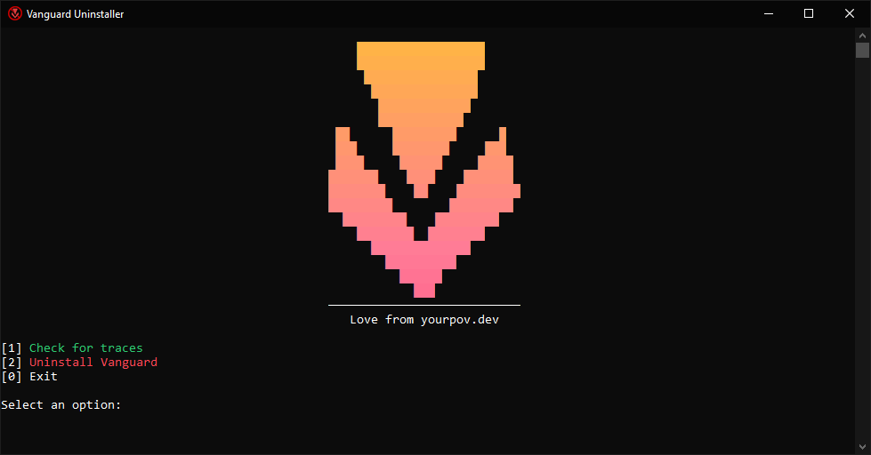

<div align="center">

# Vanguard Uninstaller

**app to cleanly remove Riot Vanguard**


[](https://github.com/yourpovv/VAN-Uninstaller)



</div>


## Usage

Download from: [releases](https://github.com/yourpovv/VAN-Uninstaller/releases/download/V1.0.0/VAN-Uninstaller.exe)

**1**: checks for vanguard traces  
**2**: uninstalls vanguard then asks to restart riot games  
**0**: closes the app

## Build

needs MinGW-w64 (`gcc`, `windres`).

```
build.bat
```

Outputs `build\VAN-Uninstaller.exe`.

## License

[MIT LICENSE](LICENSE)
